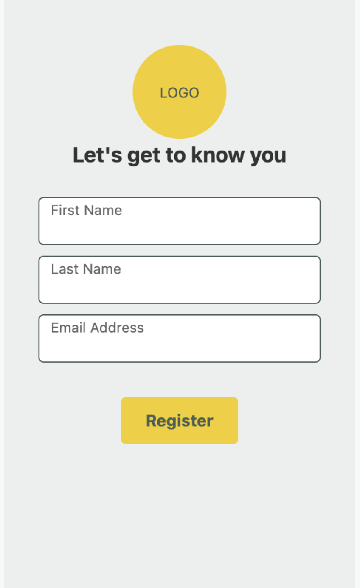
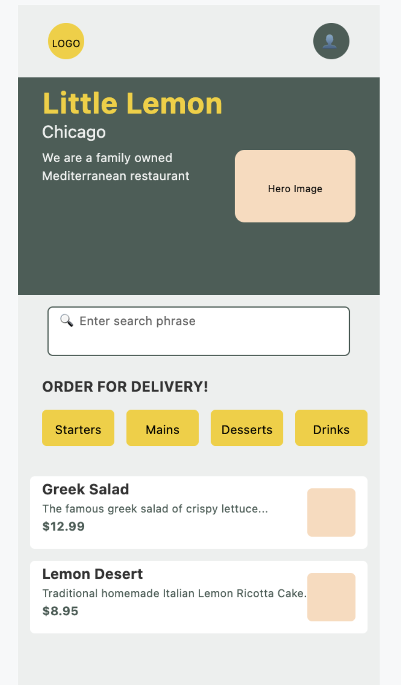
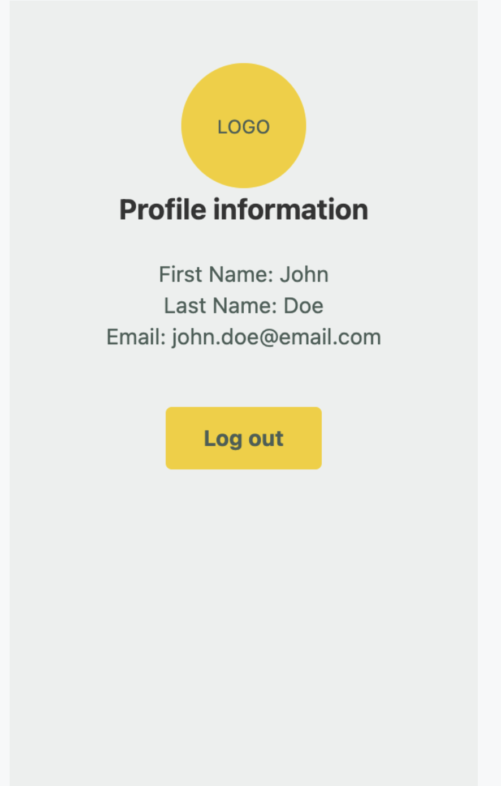

I'll analyze your Little Lemon Android app code and provide both visualizations and explanations.

## 🎨 App Visualization (SVG)

### Onboarding Screen



### Home Screen

<svg width="300" height="600" xmlns="http://www.w3.org/2000/svg">
  <!-- Top App Bar -->
  <rect width="300" height="60" fill="#EDEFEE"/>
  <circle cx="40" cy="30" r="15" fill="#F4CE14"/>
  <text x="40" y="35" text-anchor="middle" font-size="8">LOGO</text>
  <circle cx="260" cy="30" r="15" fill="#495E57"/>
  <text x="260" y="35" text-anchor="middle" font-size="12" fill="white">👤</text>
  
  <!-- Hero Section -->
  <rect x="0" y="60" width="300" height="180" fill="#495E57"/>
  <text x="20" y="90" font-size="24" font-weight="bold" fill="#F4CE14">Little Lemon</text>
  <text x="20" y="110" font-size="14" fill="#EDEFEE">Chicago</text>
  <text x="20" y="130" font-size="10" fill="#EDEFEE">We are a family owned</text>
  <text x="20" y="145" font-size="10" fill="#EDEFEE">Mediterranean restaurant</text>
  <rect x="180" y="120" width="100" height="60" fill="#FBDABB" rx="8"/>
  <text x="230" y="155" text-anchor="middle" font-size="8">Hero Image</text>
  
  <!-- Search Bar -->
  <rect x="0" y="240" width="300" height="60" fill="#EDEFEE"/>
  <rect x="25" y="250" width="250" height="40" fill="white" stroke="#495E57" stroke-width="1" rx="4"/>
  <text x="35" y="265" font-size="10" fill="#666">🔍 Enter search phrase</text>
  
  <!-- Category Buttons -->
  <rect x="0" y="300" width="300" height="80" fill="#EDEFEE"/>
  <text x="20" y="320" font-size="12" font-weight="bold" fill="#333">ORDER FOR DELIVERY!</text>
  <rect x="20" y="335" width="60" height="30" fill="#F4CE14" rx="4"/>
  <text x="50" y="355" text-anchor="middle" font-size="10">Starters</text>
  <rect x="90" y="335" width="60" height="30" fill="#F4CE14" rx="4"/>
  <text x="120" y="355" text-anchor="middle" font-size="10">Mains</text>
  <rect x="160" y="335" width="60" height="30" fill="#F4CE14" rx="4"/>
  <text x="190" y="355" text-anchor="middle" font-size="10">Desserts</text>
  <rect x="230" y="335" width="60" height="30" fill="#F4CE14" rx="4"/>
  <text x="260" y="355" text-anchor="middle" font-size="10">Drinks</text>
  
  <!-- Menu Items -->
  <rect x="0" y="380" width="300" height="220" fill="#EDEFEE"/>
  <!-- Menu Item 1 -->
  <rect x="10" y="390" width="280" height="60" fill="white" rx="4"/>
  <text x="20" y="405" font-size="12" font-weight="bold" fill="#333">Greek Salad</text>
  <text x="20" y="420" font-size="9" fill="#495E57">The famous greek salad of crispy lettuce...</text>
  <text x="20" y="435" font-size="10" font-weight="bold" fill="#495E57">$12.99</text>
  <rect x="240" y="400" width="40" height="40" fill="#FBDABB" rx="4"/>
  
  <!-- Menu Item 2 -->
  <rect x="10" y="460" width="280" height="60" fill="white" rx="4"/>
  <text x="20" y="475" font-size="12" font-weight="bold" fill="#333">Lemon Desert</text>
  <text x="20" y="490" font-size="9" fill="#495E57">Traditional homemade Italian Lemon Ricotta Cake...</text>
  <text x="20" y="505" font-size="10" font-weight="bold" fill="#495E57">$8.95</text>
  <rect x="240" y="470" width="40" height="40" fill="#FBDABB" rx="4"/>
</svg>
```

### Profile Screen


## 📱 How This App Is Made

### **AndroidManifest.xml Explanation**

The manifest file is like a "blueprint" that tells Android about your app:

```xml
<uses-permission android:name="android.permission.INTERNET"/>
<uses-permission android:name="android.permission.POST_NOTIFICATIONS"/>
```
- **Permissions**: Requests internet access (for fetching menu data) and notification posting rights

```xml
<application android:theme="@style/Theme.LittleLemon">
```
- **App Configuration**: Sets the app theme, icon, and other global settings

```xml
<activity android:name=".MainActivity" android:exported="true">
    <intent-filter>
        <action android:name="android.intent.action.MAIN" />
        <category android:name="android.intent.category.LAUNCHER" />
    </intent-filter>
</activity>
```
- **Main Activity**: Defines MainActivity as the entry point (the screen that opens when you tap the app icon)

### **App Organization & Main Concepts**

#### **🏗️ Architecture Overview**
This is a **modern Android app** built with **Jetpack Compose** using these key concepts:

#### **1. UI Layer (Jetpack Compose)**
- **Composables**: Functions that describe UI (`@Composable`)
- **Navigation**: Screen-to-screen movement using Navigation Compose
- **State Management**: Using `remember`, `mutableStateOf` for reactive UI

#### **2. Data Layer**
- **Room Database**: Local storage for menu items
- **Network Layer**: Ktor HTTP client for API calls
- **SharedPreferences**: Simple key-value storage for user data

#### **3. Navigation System**
```kotlin
// Destinations.kt - Screen routes
object HomeDestination : Destinations { override val route = "Home" }
object ProfileDestination : Destinations { override val route = "Profile" }
object OnboardingDestination : Destinations { override val route = "Onboarding" }
```

#### **🔧 How Main Concepts Work Together**

**App Flow:**
1. **MainActivity** → Entry point, sets up database and navigation
2. **NavigationComposable** → Decides first screen based on user registration status
3. **Screens** → Three main screens (Onboarding, Home, Profile)

**Data Flow:**
1. **Network** → Fetches menu from API using Ktor
2. **Database** → Stores menu locally using Room
3. **UI** → Displays data using Compose with reactive state

**Key Integration Points:**

**🔄 MainActivity (The Orchestrator):**
```kotlin
class MainActivity : ComponentActivity() {
    private val httpClient = HttpClient(Android) // Network client
    private val database by lazy { Room.databaseBuilder(...) } // Database
    
    override fun onCreate() {
        // 1. Set up UI with Compose
        // 2. Initialize navigation
        // 3. Fetch and cache menu data
    }
}
```

**🎯 Navigation Logic:**
```kotlin
val hasUserData = hasUserDataInSharedPreferences()
startDestination = if (hasUserData) OnboardingDestination.route else HomeDestination.route
```
- Checks if user is registered → directs to appropriate screen

**📊 Data Management:**
- **Network**: `MenuItemNetwork` → API response format
- **Database**: `MenuItemRoom` → Local storage format  
- **Conversion**: `toMenuItemRoom()` → Bridges network and database

**🎨 UI Composition:**
- **Shared Components**: `TopAppBar` used across screens
- **Screen-Specific**: Each screen has its own Composable
- **Theme System**: Centralized colors, typography, shapes

**🔐 User Management:**
- **SharedPreferences**: Stores user profile (firstName, lastName, email)
- **Conditional Navigation**: Shows onboarding if not registered

